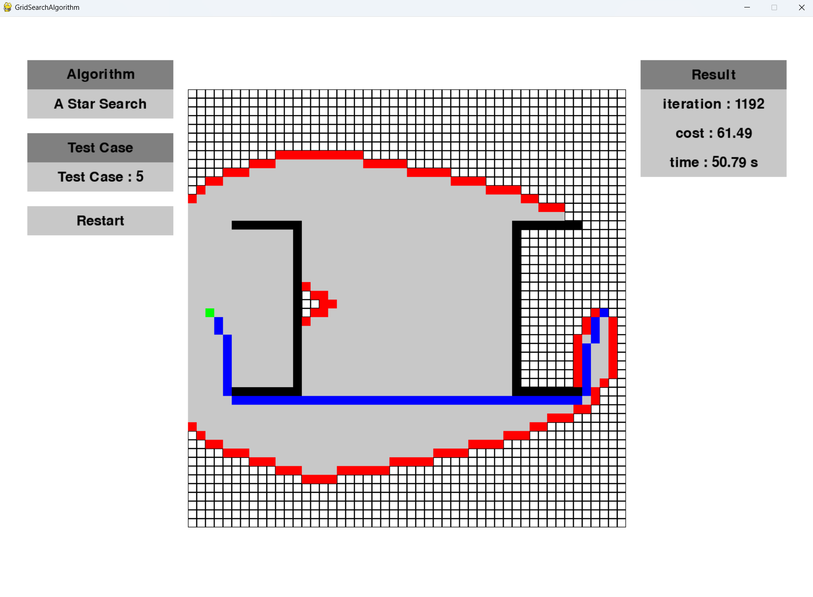

# Grid-based_Search_Algorithm
## Breath First Search, A Star Search, Best First Search

This repository is the homework of the FRA532 Mobile Robot course for third-year students at the Institute of Field Robotics (FIBO), King Mongkut’s University of Technology Thonburi (KMUTT).

## Installation
Here's the version of the libraries that I used
```
pip install pygame==2.5.2
pip install numpy==1.24.3
```
and python(3.8.6)

## Result

### Test Case 0

Test Case 0 | #Breath First Search | #A * Search | #Best First Search
--- | --- | --- | --- |
iteration  | 625 | 25 | 25 |
cost  | 33.94 | 33.94 | 33.94 |
time (s)  | 27.91 | 1.10 | 1.08 |

#### Breath First Search

#### A * Search

### Best First Search 


-------------------------
### Test Case 1

| Test Case 1 | Breath First Search | A * Search | Best First Search |
| --- | --- | --- | --- |
| iteration | 2044 | 439 | 55 |
| cost | 71.64 | 71.64 | 72.23 |
| time (s) | 92.12 | 19.39 | 2.39 |

#### Breath First Search

#### A * Search

### Best First Search 


-------------------------
### Test Case 2

| Test Case 2 | Breath First Search | A * Search | Best First Search |
| --- | --- | --- | --- |
| iteration | 1530 | 675 | 80 |
| cost | 76.91 | 76.91 | 87.30 |
| time (s) | 70.30 | 29.61 | 4.16 |

#### Breath First Search

#### A * Search

### Best First Search 


-------------------------

### Test Case 3

| Test Case 3 | Breath First Search | A * Search | Best First Search |
| --- | --- | --- | --- |
| iteration | 2337 | 720 | 189 |
| cost | 57.38 | 57.38 | 57.97 |
| time (s) | 97.80 | 30.68 | 8.41 |

#### Breath First Search

#### A * Search

### Best First Search 


-------------------------

### Test Case 4

| Test Case 4 | Breath First Search | A * Search | Best First Search |
| --- | --- | --- | --- |
| iteration | 2446 | 1151 | 98 |
| cost | 57.38 | 57.38 | 62.07 |
| time (s) | 104.85 | 50.09 | 4.42 |

#### Breath First Search

#### A * Search

### Best First Search 


-------------------------

### Test Case 5

| Test Case 5 | Breath First Search | A * Search | Best First Search |
| --- | --- | --- | --- |
| iteration | 2412 | 1192 | 241 |
| cost | 61.49 | 61.49 | 75.04 |
| time (s) | 104.42 | 50.79 | 10.85 |

#### Breath First Search

#### A * Search

### Best First Search 


--------------

## **Conclusion :**

The experiment revealed that both breadth-first search and A search can find optimal solutions. However, breadth-first search takes longer and requires more iterations compared to A search. While best-first search offers the fastest execution time and fewest iterations, it may not guarantee optimal solutions.